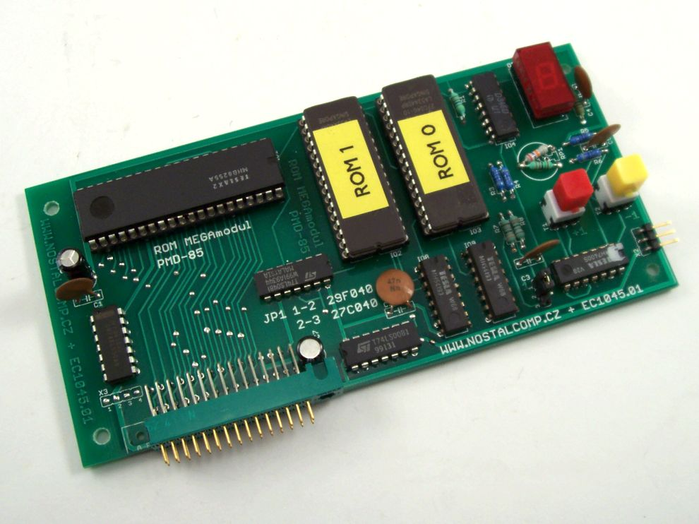
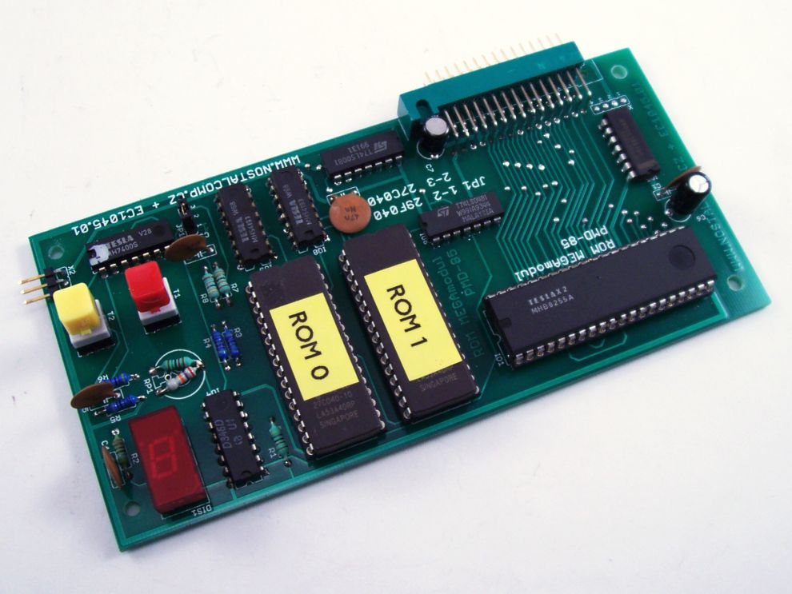
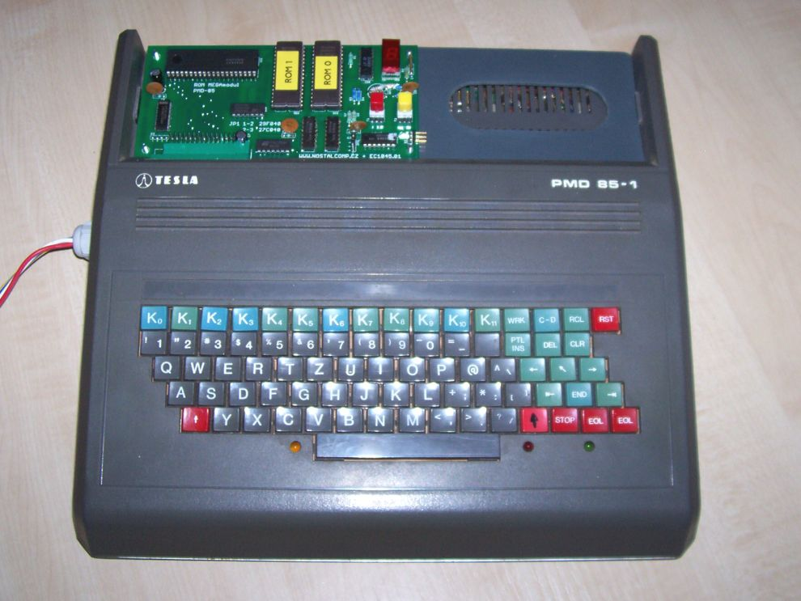
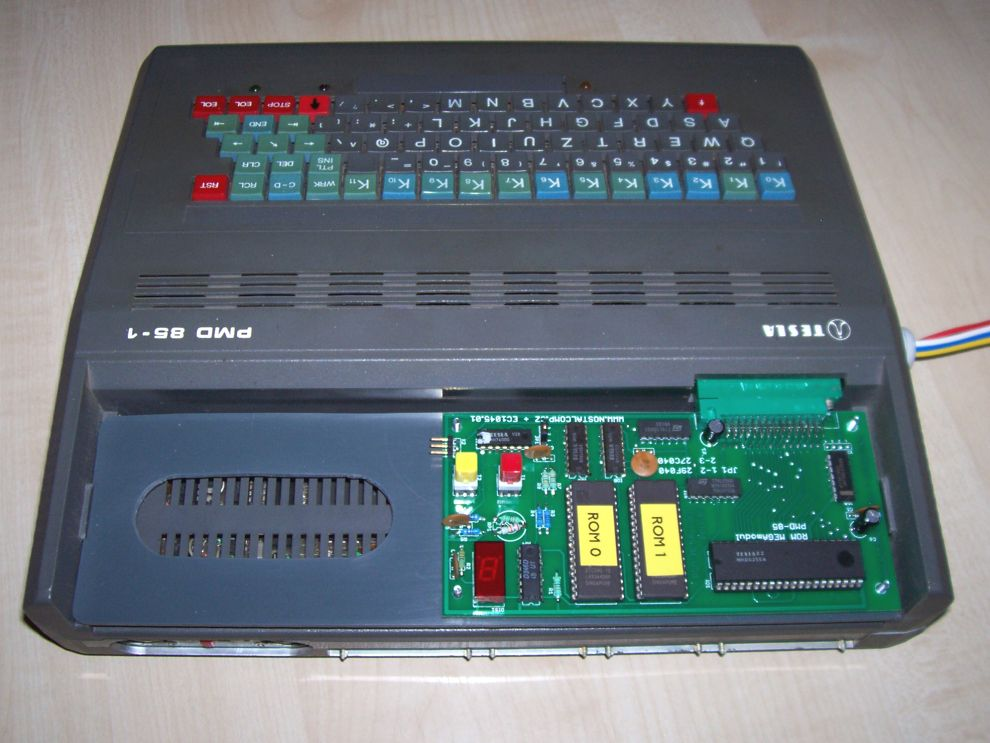

Note that this has been auto-translated from the original Czech which now only exists on a Web [Archive page](https://web.archive.org/web/20170906110934/http://www.nostalcomp.cz/pmd_megamodul.php) :( 

I will tidy up the translation over time ...  

# Original PMD-85 ROM MEGA Module
A printed circuit board is now available for the MEGA module ! Compared to the prototype (see below on the page), it already has two buttons for incrementing and decrementing the page. There is also a jumper used to select whether the memory used is of the EPROM or FLASH type (but both must always be of the same type). The software content is also somewhat richer than what is available on this page. I can't update.....

## Prototype ROM MEGAmodule for PMD-85
Quite unexpectedly, in the spring of 2013, I started working on the legendary PMD-85 . It was the first real computer I had the chance to work (and play) on. Just first love . And you don't forget your first love (but the very first one was a TI-58C calculator :-)). I haven't seen a PMD-85 in almost 25 years . It wasn't until the middle of last year (2012) that I acquired two specimens. Version 1 (that's the real PMD-85 for me) and version 2A (I've never worked on twos and probably never even seen a three in real life). The computers rested peacefully at the bottom of the box. The reason for their withdrawal was the purchase of two PMD-10 sources, which appeared on Aukra at the end of last year for a pleasantly low price. It should be noted that all 4 devices were non-functional . I bought the sources as non-functional, but I did not know the condition of the computers. It's all working again and I hope that I will get around to starting a section on PMD and I will describe my anabasis with their operation . It would certainly be useful to others as well (especially the descriptions of the " preparations " I made for it). However, in the following paragraphs, I would like to introduce a little thing that I carried in my head for a long time, but only now built it: ROM MEGAmodul

## Description of the MEGAmodule
The ROM MEGA module is a replacement for the original PMD-85 ROM module . It just has a bit more capacity , so that I have the most popular programs for PMD permanently available immediately. I know that nothing revolutionary is possible, and that I am certainly not the first to build something like this and certainly not the first to think of something like this. Although the module is labeled MEGA , I currently have "only" a half- megabyte Flash 29F040 (512x8 bytes) installed. However, a 27C080 Mega Eprom can be inserted into the DIL32 socket (after a little modification) . However, a smaller memory ( 29F010 or 29F020 ) can be installed directly. The Meg Flash will no longer fit into the DIL 32 case (the /WE signal is interfering there). But otherwise, the theoretical capacity of the ROM module is almost unlimited from above... However, half a mego will probably be enough for me :-)

Of course, there are certain limitations . The main thing is that the PMD-85 can natively (without modifications) work only with a module with a maximum capacity of 32KB . The original modules were usually only 16 kilobytes , but you can really connect a 32KB module without any restrictions or modifications. Therefore, if we use a larger memory, paging is necessary . In my case , 16 pages with a capacity of 32KB are available . It can be imagined as if 16 different ROM modules were connected to the PMD at the same time and only a switch was used to choose which would be active. And since the modules are á 32KB , it's quite a lot of space, at least for that oneessential PMD-85 software .

# Memory in the MEGA module
The memory is connected to the system via the standard 8255A circuit , as with the original ROM module . In essence, only two integrated circuits suffice : 8255A + memory . And a snitch. This is provided that switching pages will be solved in some primitive way, for example jumpers , or a mechanical hexadecimal coded switch . From the beginning, however, I intended to solve the switching in software directly from the PMD and at the same time leave the possibility of manual page (module) selection. At the same time, I wanted module 0 to always be selected after power-up or reset, which would mainly contain mandatory BASIC . Just like the original PMD-85. This is accomplished by a presettable counter with an asynchronous reset in the form of a 74193 circuit .

# Switching pages
Thus, the 74193 circuit acts as a page select register that can be written to from the computer. At the same time, the button can be used to incrementally select the page manually, and page 0 is always set at Reset. Manual incrementation is ensured by a jitter-free button (switch button + RS flip-flop from 7400). Of course, it would be possible to connect a second (decrementing) button, but I found it unnecessary. Software selection of the page is possible from the "engineer" as well as from BASIC with the OUT instruction . I found and occupied a "hole" in the I/O map, so the page register "sits" at the address 6Fh(from BASIC it's decimal 111 ). The address is unambiguously decoded with a simpledecoder from circuits 7420 and 7432 . So I didn't have a 7420 in LS design, so I put in a 74LS22 (open collector) and added 2 pullups . In order to make it clear which page (module) is currently active, I completed the indication through a seven-segment LED display with a D346D decoder . This is THE decoder that can also use hexadecimal characters . Although I gave it there with a heavy heart , I gave it. It would be simpler to use a sign box with an already built-in decoder (but I would be sorry for that much more), or just the LEDs themselves (I didn't think that was sexy enough).

The prototype was created again by wiring on a universal . At the moment, I have the defective original ROM module on the way, from which I intend to use the cover and therefore cover my MEGA module in an original way . Yes, and there will also be a fan :-))

# Software
As for the software , I have filled 7 pages so far (but not all of them are completely full). So far, mostly games that in the original are started manually after uploading from MGF . Programs with autostart must be modified a little bit. This may (but may not) be a bit more laborious . However, I've already modified mainly MANIC (that's why I'm actually doing it :-)), Pampuch , Horace and I'm quite interested in Pontris as well . Hopefully I'll get to the other "pieces" in time. At this stage, I still have to load and run the programs by first manually switching to the page with the desired program and then loading it with the JOB command. The downloaded program will start at the same time. For programs that don't start at their starting address, a small adjustment was necessary, or I created a drag-in routine for them . With JOB, I only run this routine, which takes care of the rest.

However, there is also a kind of " software catalog " under development , i.e. a program which will be placed in the 0 page and which, after starting, will print a pre-prepared list (not to be confused with the website Seznam.cz :-)) of all available programs in the MEGA module. After entering the number of the relevant program , it loads it into RAM and starts it. Of course, it will automatically switch to the correct page first . It will be a simple program in BASIC (I don't intend to mess with the texts in typewriter), which will be started by the command ROM (about ROM 6) from BASIC. However, the actual transfer and execution of the target program will be ensured by the machine routine, which the BASIC program first " learns " into free RAM next to VIDEORAM. Here, however, there is no continuous section of free memory, but only 16-byte blocks . The routine is thus divided into 4 parts, which bounce between each other in different ways . But the advantage of being placed next to the VIDEORAM is that the entire user RAM 0000h-7FFFhis available to the running program (I keep getting the word application here , but ugh!) The routine is already debugged, but before the catalog is finished, it is necessary to "stabilize" at least the basic software content of the MEGAmodule , i.e. cram as many program applications there as possible .

For now, I am attaching the first working version of the software "stuffing" for the MEGA module. But more content is in the works! The software is in a 512Kbyte binary for the 29F040 , but it can be "trimmed" as needed. So far, everything can fit in the 29F020 (256KB). A PDF text book with a list of software and JOB parameters for starting is also included .

# Conclusion
So much for the description of my new news :-) I know it's nothing groundbreaking , but I always try to have some " demonstration " software immediately available on my computers and I always try to use only original computer resources . That is, without radical interventions in the HW and, if possible, no interventions in the original Firmware . I'm also not a big fan of the various " ultra-modern " gadgets made of modern components (CPLD, FPGA, single-chips, etc.) that are densely connected to these old computers. But, not that I condemn them. Not that! I admire their creator . I like it technically. But I just don't like the old technique ...

In their time, designers could only dream of a half-megabyte Flash memory . But it's still classic memory and if it's in a classic DIP case, I have no problem with it. I hope I can actually get around to starting that PMD-85 column . Strangely enough, I also drew a diagram for the MEGAmodule and when its content is stabilized (for now I'm solving everything only for PMD version 1), I'll make it all available . Finally, I would like to thank the Bórik brothers for their bombastic PMD-85 emulator . Without it, preparing the software for the MEGA module would be unimaginably laborious. And especially! Without it, I probably would never have returned to the PMD-85. And yet it is God's computer.Almost like PMI-80 :-)

Another small note on the possibilities of direct writing to Flash memory directly from PMD. It would work. Of course it worked. But who would use it and why? Preparing software for PC is much more convenient and faster thanks to the emulator , so why bother with writing...