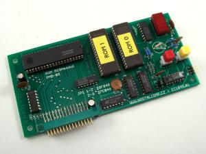

# ROM MEGAmodule
A new ROM module that plugs into the top of the machine to give access to a lot more software instantly. 
The original ROMs were usually 16KB in size, although up to 32KB could be used. 
 
{19-Set-2023} 
This is still very much a work-in-progress! 

## [Kicad](Kicad)
My re-drawn schematic from the original design with some small changes. 
These changes include: 
- replace obsolete D346 7-segment LED decoder with 74HCT4511, 
- replace "Slovak-specific" Tesla LQ425 7-segment LED with more common part. 

## [Original Design](Original_Design)
The original design that I'm working from - thank you nostalcomp.cz 

